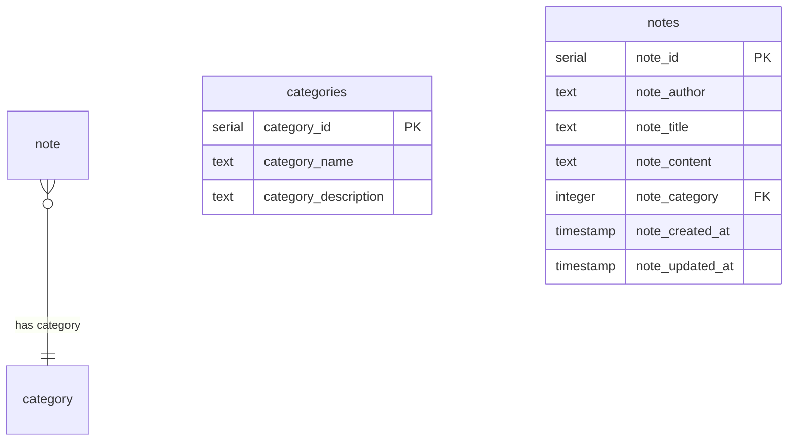

```mermaid
erDiagram
  note }o--|| category : "has category"

   categories {
    serial category_id PK
    text category_name
    text category_description
  }

  notes {
    serial note_id PK
    text note_author
    text note_title
    text note_content
    integer note_category FK
    timestamp note_created_at
    timestamp note_updated_at
  }

```
