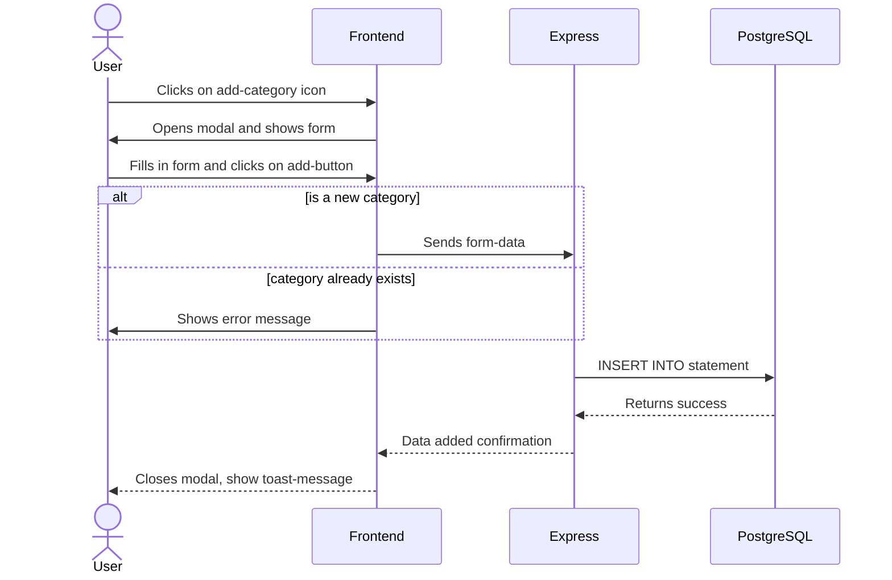

```mermaid
sequenceDiagram
actor User
participant UI as Frontend
participant Service as Express
participant DB as PostgreSQL

    User->>UI: Clicks on add-category icon
    UI->>User: Opens modal and shows form
    User->>UI: Fills in form and clicks on add-button
    alt is a new category
    UI->>Service: Sends form-data
    else category already exists
    UI->>User: Shows error message
    end
    Service->>DB: INSERT INTO statement
    DB-->>Service: Returns success
    Service-->>UI: Data added confirmation
    UI-->>User: Closes modal, show toast-message
```
